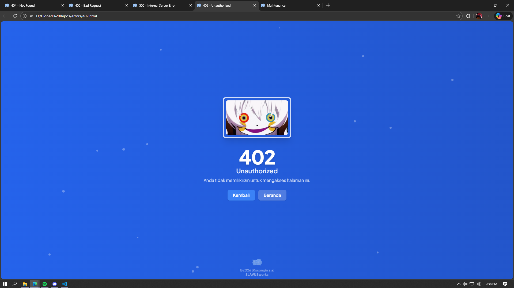
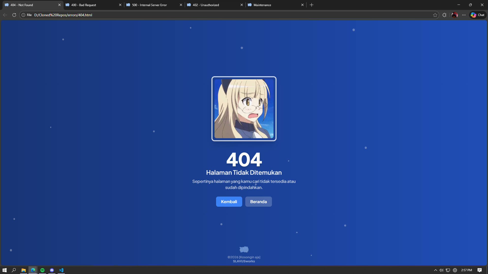
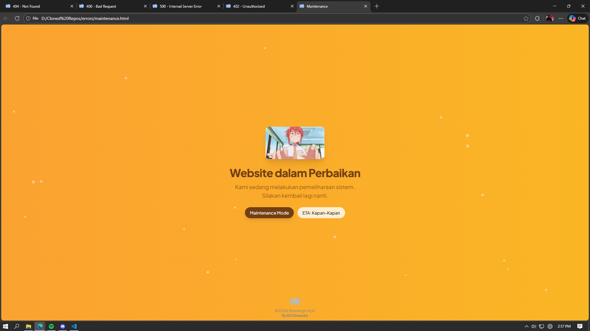

# HTTP-Status-Anime

Simple **HTTP status codes** information with anime gif as extras.
Each status code is represented by its own HTML page with a clean and minimal design.

---

## Preview

Some example pages from this project:

### 400 – Bad Request


### 402 – Payment Required



### 404 – Not Found



### 500 – Internal Server Error


### Maintenance Page



---

## Tech Stack

- HTML
- JavaScript
- Tailwind CSS

---

## Project Structure

```text
.
├── sample/
├── 1xx.html
├── 2xx.html
├── 3xx.html
├── 4xx.html
├── 5xx.html
├── maintenance.html
├── root.css
└── README.md
```

## License

This project is licensed under the **MIT License**.

You are free to use, modify, and distribute this project, as long as the original license is included.  
See the full license details here: [MIT License](https://choosealicense.com/licenses/mit/)
